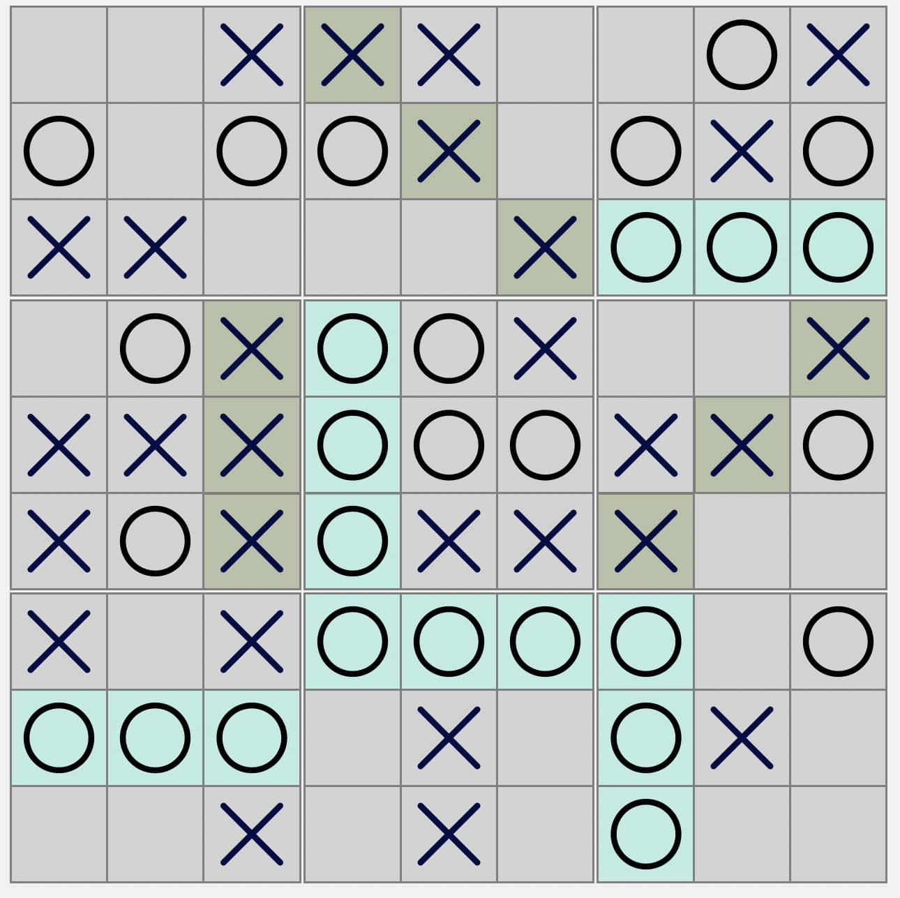
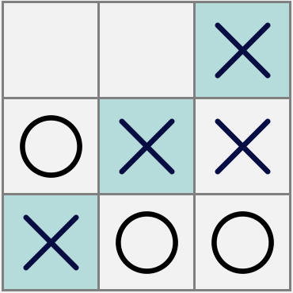
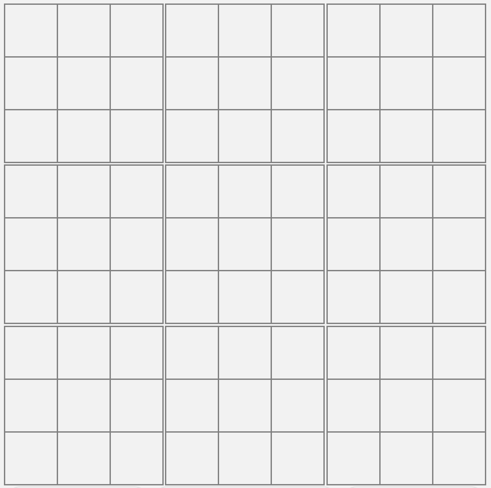
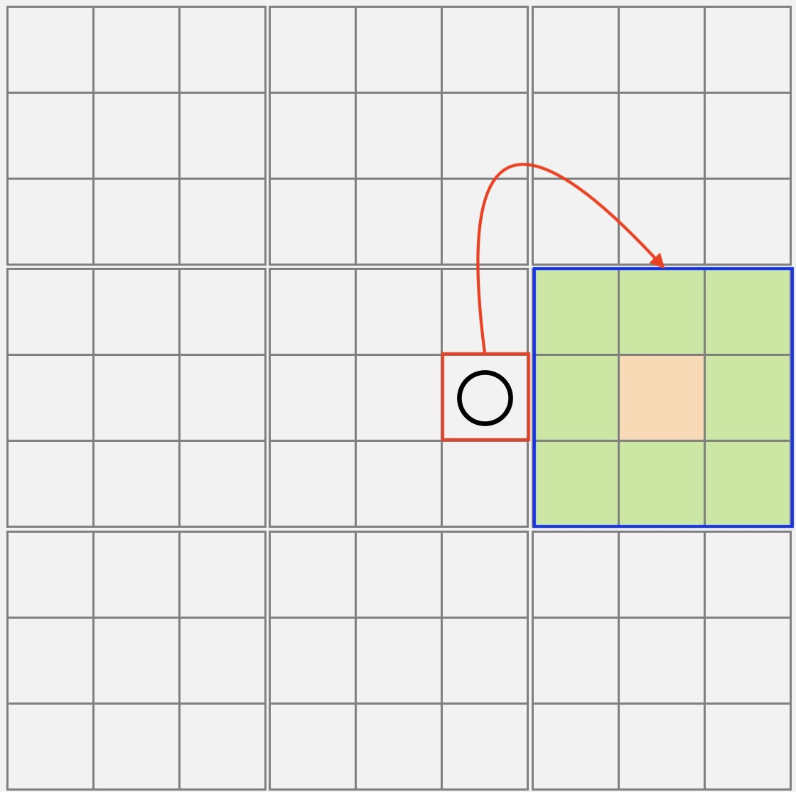
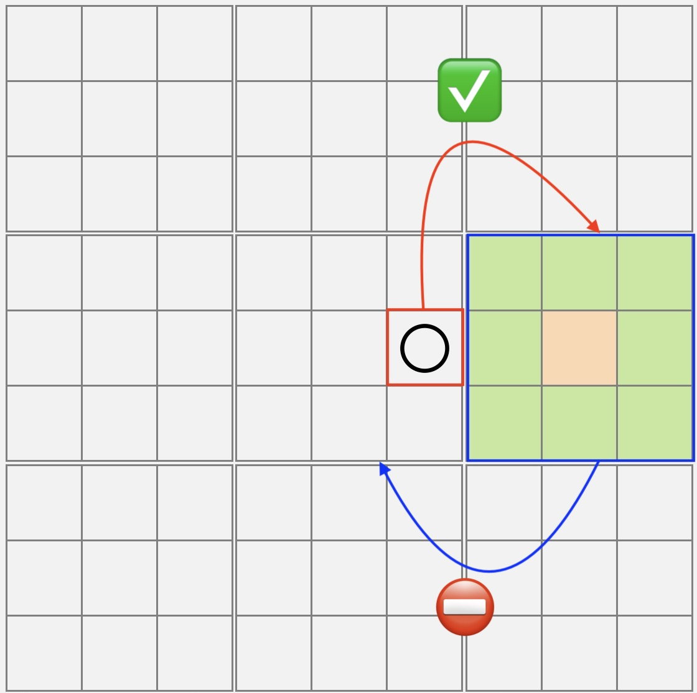
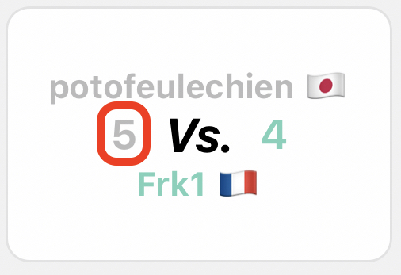
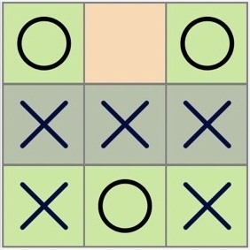
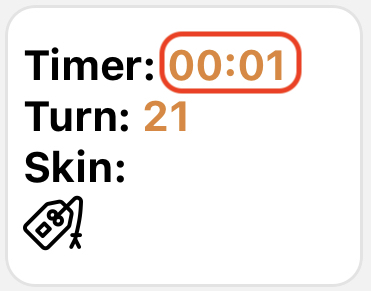
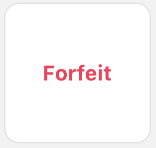

<!-- Text can be **bold**, _italic_, or ~~strikethrough~~.

[Link to another page](./another-page.html).

There should be whitespace between paragraphs.

There should be whitespace between paragraphs. We recommend including a README, or a file with information about your project. -->

# OTTERWORKS

Born in 2022, OTTERWORKS aims at creating fun and engaging mobile games. Our in-house crafted puzzle games make us unique.

We just launched STRAPION, our very first game.

## DOWNLOAD NOW

{:target="_blank"} [{:height="27%" width="27%"}](https://play.google.com/store/apps/details?id=com.strapion&hl=fr&gl=US&pli=1){:target="_blank"}

## Discover Strapion

### Intro
Strapion is a PvP board game for iOS and Android. Built to be:

* Fun
* Strategic
* Social
* Competitive
* Online

<!--  --> 

### Remember the tic-tac-toe ?

{:height="30%" width="30%"}

Get 3 of your marks in a row (up, down, across, or diagonally) and you win.

### Strapion, the strategic tic-tac-toe

A Strapion board has nine grids, each composed of 9 cells. These are actually nine tic-tac-toe grids. Each grid won brings you 1 point.

During the first turn, the player who starts the game can play anywhere.

{:height="50%" width="50%"}

### Next grid rule

But from the second turn, a few rules apply.

The playable grid (blue) is defined by which cell has been played during the previous turn (red).

{:height="50%" width="50%"}

### Orange cell rule

It is forbidden to send your opponent to the previous grid. The forbidden cell, when applicable, will appear in orange.

{:height="50%" width="50%"}

### A game is finished when

One player scored 5 points

{:height="30%" width="30%"}

No playable cell remaining

{:height="30%" width="30%"}

Time out

{:height="30%" width="30%"}

One player forfeited

{:height="30%" width="30%"}

## About OTTERWORKS

OTTERWORKS is game publisher based in Tokyo, Japan.

Inquiries:

Email: hello@otterworks.co

Postal: 134-0083  -  Tokyo-to, Edogawa-ku, Naka-Kasai 2-27-14 801.